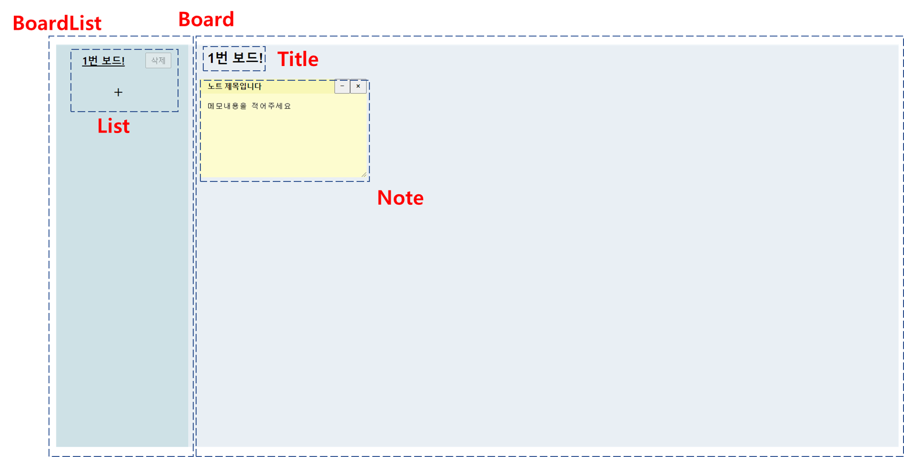

#### 1. 프로젝트 소개

포스트 잇 노트들을 카테고리별로 보드에 관리할 수 있는 웹 애플리케이션입니다.


#### 2. 실행

```shell
npm i
npm start
```


#### 3. 폴더구조 및 화면

```bash
`-- src
    |-- App.tsx
    |-- components
    |   |-- List
    |   |-- Notes
    |   |-- Title
    |   `-- common
    |-- index.scss
    |-- index.tsx
    |-- layout
    |   |-- Board
    |   |-- BoardList
    |   `-- Container
    `-- redux
```

> `index.tsx`  앱 시작 파일
>
> `index.scss`  전역 스타일 정의
>
>  `App.tsx`  페이지 정의; 전체 레이아웃과 컴포넌트들을 사용
>
> `components/List`  좌측 보드 목록 컴포넌트 
>
> `components/Notes` 여러개의 노트들을 렌더링하는 컴포넌트
>
> `components/Title`  우측 레이아웃 보드의 제목을 표시하는 컴포넌트
>
> `components/common`   공통으로 사용하는 컴포넌트들; 예: 버튼, 다이어로그 등
>
> `layout/Board` 레이아웃 컴포넌트: 우측 보드
>
> `layout/BoardList`  레이아웃 컴포넌트: 좌측 보드목록
>
> `layout/Container` 레이아웃 컴포넌트: `Board`와 `BoardList`의 부모
>
> `redux`   리덕스 설정 및 상태관리 리듀서들 정의




#### 4. 미구현된 사항들

- 포스트잇 드래그 기능
- 포스트잇 크기 조절 기능
- `ctrl` (or `cmd`) + `alt` +  `n`  입력을 통해, 새로운 포스트잇을 생성되나, 제목을 수정할 수 있는 상태로 바뀌지 않고있습니다


#### 5. 기타

- 디바운싱은 우측 보드의 제목을 수정할 때 적용됩니다

- 포스트잇의 제목과 내용의 수정은 저장/취소 버튼을 클릭할 때 상태를 저장하여, 디바운싱 처리하지 않았습니다

- 새로고침 후 데이터 유지를 위해 `redux-persist` 를 설치 후 사용하였습니다

- 포스트잇의 드래그 기능은 [이 링크](https://stackoverflow.com/questions/20926551/recommended-way-of-making-react-component-div-draggable)를 참고하며 구현 중이었습니다.